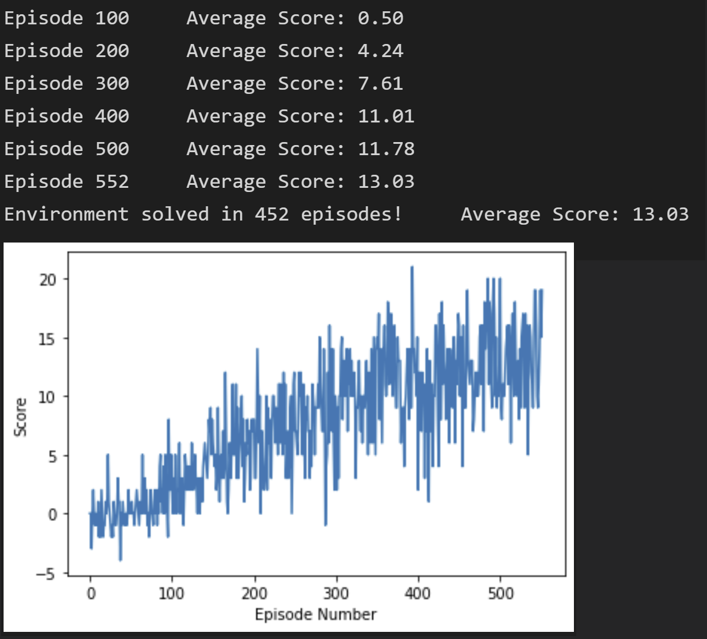
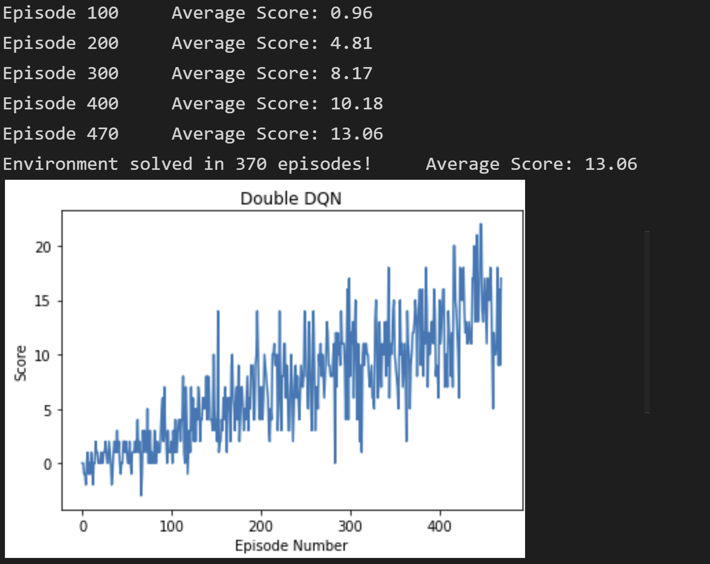

# Project 1: Navigation

## Description of the implementation

### Algorithm
The base reinforcement learning algorithm implemented to solve the navigation challenge for this food collection environment is based on [Deep Q-Network](https://storage.googleapis.com/deepmind-media/dqn/DQNNaturePaper.pdf).

### Hyperparameters
The hyperaparameters such as length of episode, epsilon values and all agent paramters were kept same as the DQN OpenAI Gym task solution.

### Network Architecture
Three fully connected layers with the number of units set as 37, 64 and 64, respectively. The output size of final layer is 4 in accordance with the size of the action space.   

### Improvement
[Double Deep Q-Network](https://arxiv.org/abs/1509.06461) was implemented which aims to reduce the overestimation detected in the vanilla DQN architecture. All other paramters, model architecture and random seed value were kept same as vanilla DQN. The number of episodes needed to solve the environment decreased from 452 to 370. 

## Plot of Rewards

### Vanilla DQN

### Double DQN

## Ideas for Future Work

- [Prioritized Experience Replay](https://arxiv.org/abs/1511.05952) can be utilized to frequently replay samples from which the agent can potentially learn more. This can make the learning process more effective.
- [Dueling Network Architecture](https://arxiv.org/abs/1511.06581) is a modified architecture which is claimed to improve policy learning especially in the presence of many similar-valued actions.
- [Rainbow](https://arxiv.org/abs/1710.02298) combines several independent improvements of DQN algorithm and is reported to outperform each of the individual imporvement. 